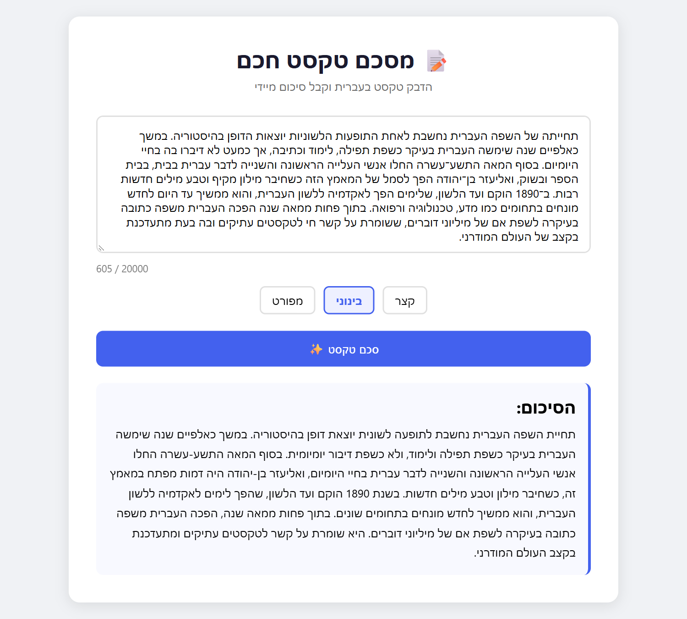

# Hebrew Text Summarizer

[](https://github.com/rafael-mishayev/hebrew-text-summarizer/actions/workflows/test.yml)

A web application that summarizes Hebrew text with an LLM, built with Python and
FastAPI. Paste a text, pick a summary length, and get a fluent Hebrew summary in a
fully right-to-left interface that works even with JavaScript turned off.

<p align="center">
  
</p>

## Features

- **Three summary lengths** - short (2-3 sentences), medium (5-7) or detailed (10-15).
- **Right-to-left, server-rendered UI** - every page is rendered on the server, so
  the form works without JavaScript; the script only adds a live character counter
  and a loading state.
- **Keyboard-accessible** - the styled length selector keeps real radio buttons
  underneath, with a visible focus ring.
- **Prompt-injection hardening** - instructions and user text travel in separate
  messages, and the text is fenced and explicitly marked as data.
- **Async model calls** - requests to OpenRouter never block the event loop.
- **Server-side validation** - the length is an enum, and empty or oversized input
  (over 20,000 characters) is rejected before any request is sent.
- **Safe, Hebrew error messages** - internal details are logged, never shown, and a
  provider rate limit (HTTP 429) is reported separately from an outage.

## Tech Stack

- **Backend:** Python, FastAPI, Uvicorn
- **AI Provider:** OpenRouter
- **Model:** Google Gemini 2.5 Flash
- **Frontend:** HTML, CSS, Jinja2
- **Testing:** Pytest, Pytest-Asyncio, FastAPI TestClient

## Design Decisions

### English instructions, Hebrew output

The model receives system instructions in English while being required to answer in Hebrew.

This keeps system instructions separate from user content and provides a clear contract for the model.

### System and user messages are separated

Application instructions are sent as a `system` message, while the source text is sent as user content.

The source text is explicitly delimited and treated as data rather than instructions, which reduces prompt-injection risk.

### Asynchronous API access

FastAPI routes are asynchronous, so the OpenRouter request also uses `AsyncOpenAI`.

This avoids blocking the event loop while waiting for the upstream AI provider.

### Backend validation

The backend validates:

- Summary length using an enum
- Empty input
- Maximum input size

The server does not rely on frontend controls for correctness.

### Safe error handling

Internal exception details, including a missing API key, are logged but are never returned directly to the user.

Rate-limit failures are handled separately from general API failures, so the user is told to retry shortly rather than that the service is down.

## Project Structure

```text
hebrew-text-summarizer/
├── main.py                  # routes; maps exceptions to safe messages
├── summarizer.py            # prompt building and the OpenRouter call
├── templates/
│   └── index.html           # RTL page, inline CSS, optional JS
├── tests/
│   ├── conftest.py          # fake OpenRouter client
│   ├── test_summarizer.py
│   └── test_app.py
├── .github/workflows/
│   └── test.yml             # CI on Python 3.12 and 3.13
├── requirements.txt
├── pytest.ini
└── .env.example
```

## Getting Started

Requires Python 3.12 or newer.

1. Clone the repository:

```bash
git clone https://github.com/rafael-mishayev/hebrew-text-summarizer.git
cd hebrew-text-summarizer
```

2. Create and activate a virtual environment:

```bash
python -m venv venv
```

Windows:

```bash
venv\Scripts\activate
```

macOS / Linux:

```bash
source venv/bin/activate
```

3. Install dependencies:

```bash
pip install -r requirements.txt
```

4. Copy `.env.example` to `.env` and add your OpenRouter API key:

```env
OPENROUTER_API_KEY=your_api_key_here
```

5. Run the application:

```bash
uvicorn main:app --reload
```

6. Open:

```text
http://127.0.0.1:8000
```

## Running Tests

```bash
pytest
```

The suite replaces the OpenRouter client with a fake, so it needs no API key and
no network access. It covers:

- **Validation** - empty and oversized input are rejected before any request, and
  text exactly at the cap is accepted.
- **Prompt construction** - for every length, instructions go in the system message
  and the source text is fenced inside the user message.
- **Failure handling** - rate limits, API failures, empty responses and a missing
  API key each map to the right exception and are logged.
- **Routes** - the RTL form, keeping input after submission, rejecting unknown
  lengths with 422, HTML-escaping model output, and error pages that never leak
  internal details.
